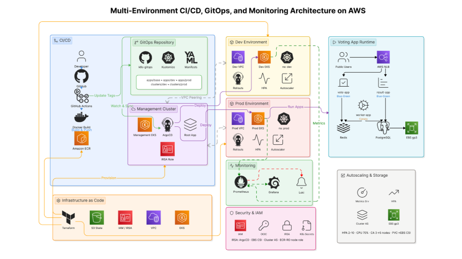
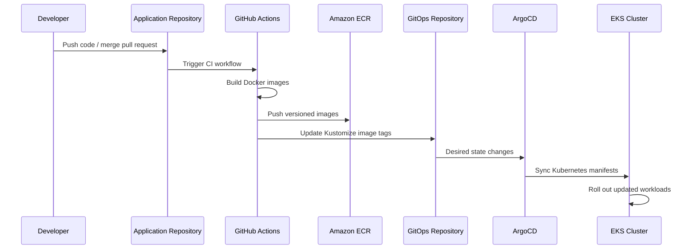

# AWS EKS GitOps Platform

A production-oriented DevOps platform project that demonstrates how to provision cloud infrastructure, deploy containerized microservices, and manage Kubernetes workloads on AWS using Infrastructure as Code, GitOps, CI/CD automation, and observability tooling.

This repository extends the classic distributed voting application into a complete AWS EKS GitOps platform. Instead of only running containers locally, the project provisions multi-environment Kubernetes infrastructure on AWS, builds and pushes container images to Amazon ECR, and promotes application changes through a GitOps workflow using ArgoCD and Kustomize.

---

## Project Overview

This project simulates a real-world platform engineering workflow for deploying and operating a microservices application on AWS EKS.

The platform includes:

- AWS infrastructure provisioning with Terraform
- Separate management, development, and production EKS environments
- ArgoCD-based GitOps deployment model
- GitHub Actions CI/CD workflows
- Amazon ECR image registry integration
- Kubernetes add-ons for cluster operations
- Monitoring stack deployment
- VPC peering automation
- Containerized microservices based on Python, Node.js, .NET, Redis, and PostgreSQL

The main goal of this project is to demonstrate how modern DevOps teams manage cloud-native applications through declarative infrastructure, automated delivery pipelines, and GitOps-driven Kubernetes operations.

---

## What I Built

In this project, I designed and implemented a DevOps platform that covers the full lifecycle of a cloud-native application:

1. Provision AWS infrastructure using Terraform.
2. Create and configure Amazon EKS clusters for multiple environments.
3. Install and configure ArgoCD as the GitOps controller.
4. Build application Docker images through GitHub Actions.
5. Push versioned images to Amazon ECR.
6. Update Kubernetes manifests automatically using Kustomize.
7. Trigger GitOps-based deployment to development and production environments.
8. Deploy monitoring and logging components for platform observability.
9. Automate cluster add-ons, networking, and operational readiness checks.

This project reflects hands-on experience with cloud infrastructure, Kubernetes operations, GitOps workflows, and CI/CD pipeline design.

---

## Architecture

The following diagram illustrates the overall platform architecture, including GitHub Actions, Amazon ECR, Terraform-managed EKS clusters, ArgoCD, and GitOps-based workload deployment.



The architecture follows a management-cluster model, where ArgoCD is installed in the management EKS cluster and is responsible for synchronizing workloads to the development and production EKS clusters.

````

---

## Technology Stack

| Area                    | Tools / Services                                  |
| ----------------------- | ------------------------------------------------- |
| Cloud Provider          | AWS                                               |
| Container Orchestration | Amazon EKS, Kubernetes                            |
| Infrastructure as Code  | Terraform                                         |
| GitOps                  | ArgoCD, Kustomize                                 |
| CI/CD                   | GitHub Actions                                    |
| Container Registry      | Amazon ECR                                        |
| Application Runtime     | Docker                                            |
| Backend Services        | Redis, PostgreSQL                                 |
| Microservices           | Python, Node.js, .NET                             |
| Monitoring              | Prometheus/Grafana/Loki-oriented monitoring stack |
| Networking              | VPC, VPC Peering                                  |
| Automation              | Shell scripts, GitHub Actions workflows           |

---

## Repository Structure

```text
.
├── .github/
│   └── workflows/                 # GitHub Actions CI/CD and infrastructure workflows
│
├── infrastructure/
│   ├── bootstrap/                 # Bootstrap configuration
│   ├── environments/              # Environment-specific Terraform stacks
│   │   ├── management-infra/
│   │   ├── management-addons/
│   │   ├── management-argocd/
│   │   ├── management-argocd-clusters/
│   │   ├── dev_infra/
│   │   ├── dev-addons/
│   │   ├── prod_infra/
│   │   ├── prod-addons/
│   │   └── add_on-vpc_peering/
│   │
│   ├── global/                    # Global infrastructure configuration
│   └── modules/                   # Reusable Terraform modules
│       ├── addons/
│       ├── argocd/
│       ├── argocd-clusters/
│       ├── ecr/
│       ├── eks/
│       ├── peering/
│       └── vpc/
│
├── monitoring-v2/                 # Monitoring stack configuration
├── healthchecks/                  # Health check resources
│
├── vote/                          # Python voting frontend service
├── result/                        # Node.js result frontend service
├── worker/                        # .NET background worker service
├── seed-data/                     # Data initialization service
│
├── docker-compose.yml             # Local development environment
├── docker-stack.yml               # Docker Swarm deployment
└── architecture.excalidraw.png    # Architecture diagram
````

---

## Application Components

The application follows a simple distributed microservices architecture:

| Component  | Description                                                       |
| ---------- | ----------------------------------------------------------------- |
| `vote`     | Python web application that receives user votes                   |
| `redis`    | In-memory queue used to temporarily store votes                   |
| `worker`   | .NET worker service that consumes votes from Redis                |
| `postgres` | Persistent database used to store processed votes                 |
| `result`   | Node.js web application that displays voting results in real time |

Although the application itself is simple, the main focus of this repository is the DevOps platform around it: infrastructure provisioning, CI/CD automation, GitOps deployment, Kubernetes operations, and monitoring.

---

## Infrastructure Design

The infrastructure is organized into reusable Terraform modules and environment-specific stacks.

### Main Infrastructure Modules

| Module            | Purpose                                                        |
| ----------------- | -------------------------------------------------------------- |
| `vpc`             | Creates the network foundation for EKS clusters                |
| `eks`             | Provisions Amazon EKS clusters                                 |
| `ecr`             | Creates Amazon ECR repositories for application images         |
| `argocd`          | Installs and configures ArgoCD                                 |
| `argocd-clusters` | Registers workload clusters with the management ArgoCD cluster |
| `addons`          | Installs Kubernetes operational add-ons                        |
| `peering`         | Automates VPC peering between environments                     |

### Environments

The project separates infrastructure into multiple environments:

- `management` — hosts ArgoCD and platform control components
- `dev` — development workload cluster
- `prod` — production workload cluster

This separation demonstrates a platform-oriented architecture where the management cluster controls application delivery into workload clusters.

---

## CI/CD and GitOps Workflow

The deployment workflow follows a GitOps-based model.



### CI/CD Pipeline Responsibilities

The GitHub Actions workflow performs the following tasks:

1. Checkout application source code.
2. Authenticate to AWS.
3. Login to Amazon ECR.
4. Build Docker images for:
   - `vote`
   - `result`
   - `worker`

5. Push images to Amazon ECR.
6. Clone the GitOps repository.
7. Update image tags using Kustomize.
8. Commit and push manifest changes.
9. Let ArgoCD synchronize the desired state to EKS.

For development deployments, the image tag is based on the Git commit SHA.
For production deployments, the workflow requires an explicit version tag such as `v1.0.0`.

---

## Infrastructure Deployment Workflow

The infrastructure pipeline provisions the platform in stages:

1. Provision management infrastructure.
2. Wait for the management EKS cluster to become active.
3. Install management add-ons.
4. Install and validate ArgoCD.
5. Provision development infrastructure.
6. Install development cluster add-ons.
7. Provision production infrastructure.
8. Install production cluster add-ons.
9. Register workload clusters with the management ArgoCD instance.

The workflow includes readiness checks for:

- EKS cluster status
- Kubernetes nodes
- CoreDNS
- ArgoCD server
- ArgoCD repo server
- ArgoCD application controller
- ArgoCD Redis
- Metrics Server
- Argo Rollouts
- Cluster Autoscaler

This makes the pipeline more reliable because each stage validates that the previous platform component is operational before moving forward.

---

## Local Development

You can run the application locally using Docker Compose.

```bash
docker compose up --build
```

After the containers are running:

| Service    | URL                   |
| ---------- | --------------------- |
| Vote App   | http://localhost:8080 |
| Result App | http://localhost:8081 |

To stop the local environment:

```bash
docker compose down
```

---

## Kubernetes Deployment Model

The Kubernetes deployment is managed declaratively through GitOps.

Instead of manually applying manifests with `kubectl`, the CI pipeline updates the GitOps repository, and ArgoCD continuously reconciles the cluster state with the desired state stored in Git.

This approach provides:

- Declarative application delivery
- Version-controlled Kubernetes manifests
- Clear deployment history
- Environment-specific configuration
- Easier rollback through Git history
- Reduced manual deployment drift

---

## Security and Operational Practices

This project applies several DevOps and platform engineering practices:

- Infrastructure defined as code using Terraform
- Environment separation between development and production
- GitOps-based deployment instead of manual cluster changes
- Image versioning through commit SHA and release tags
- AWS credentials managed through GitHub Actions secrets
- ECR used as the private container registry
- Readiness checks before continuing pipeline execution
- Separate management cluster for ArgoCD control plane
- Automated cluster add-on installation
- Monitoring stack prepared for platform observability

---

## Key DevOps Skills Demonstrated

This project demonstrates practical experience in:

- Designing AWS-based Kubernetes infrastructure
- Provisioning EKS clusters with Terraform
- Structuring reusable Terraform modules
- Building CI/CD pipelines with GitHub Actions
- Managing container images with Amazon ECR
- Applying GitOps principles using ArgoCD and Kustomize
- Operating multi-environment Kubernetes platforms
- Automating infrastructure deployment workflows
- Deploying microservices to Kubernetes
- Managing cluster add-ons and readiness checks
- Implementing monitoring and observability foundations
- Separating infrastructure, application, and GitOps responsibilities

---

## How to Deploy

> Note: This project creates real AWS resources. Make sure your AWS account, IAM permissions, and billing configuration are ready before running the workflows.

### Prerequisites

Install or configure the following tools:

- AWS CLI
- Terraform
- kubectl
- Docker
- GitHub account
- AWS account with permission to create EKS, VPC, ECR, IAM, and related resources

### Required GitHub Secrets

Configure the following secrets in GitHub Actions:

```text
AWS_ACCESS_KEY
AWS_SECRET_KEY
GITOPS_PAT
```

### Step 1: Deploy Infrastructure

Run the Terraform infrastructure workflow from GitHub Actions:

```text
Actions → Terraform Infrastructure Deploy → Run workflow
```

This workflow provisions the management, development, and production EKS infrastructure.

### Step 2: Deploy Application Through GitOps

Run the CI + GitOps deployment workflow:

```text
Actions → CI + GitOps Deploy → Run workflow
```

Select the target environment:

```text
dev
prod
```

For production deployment, provide a version tag:

```text
v1.0.0
```

### Step 3: Verify ArgoCD Synchronization

After the GitOps repository is updated, ArgoCD will detect the manifest changes and sync the workloads to the target EKS cluster.

You can verify the deployment with:

```bash
kubectl get pods -A
kubectl get svc -A
```

---

## Portfolio Notes

This project was built as a DevOps portfolio project to demonstrate end-to-end cloud-native platform engineering skills.

The focus is not only on deploying a sample application, but on building the surrounding platform capabilities that a real DevOps team would need:

- reproducible infrastructure,
- automated delivery,
- GitOps-based operations,
- environment separation,
- container registry integration,
- Kubernetes add-ons,
- monitoring readiness,
- and deployment governance through Git.

---

## Future Improvements

Possible improvements for this platform:

- Add HTTPS ingress with AWS Load Balancer Controller and ACM
- Add External Secrets Operator for secret synchronization
- Add sealed secrets or AWS Secrets Manager integration
- Add policy enforcement with Kyverno or OPA Gatekeeper
- Add automated security scanning for container images
- Add Terraform remote backend with state locking
- Add blue-green or canary deployment strategy with Argo Rollouts
- Add Prometheus alerts and Grafana dashboards
- Add cost monitoring for EKS and node groups
- Add disaster recovery documentation
- Add architecture screenshots and ArgoCD UI screenshots

---

## Author

**Hoàng Giang**
DevOps / Cloud / Kubernetes / GitOps Enthusiast

This project is part of my personal DevOps portfolio, focusing on AWS, Kubernetes, Terraform, CI/CD, and GitOps platform engineering.
